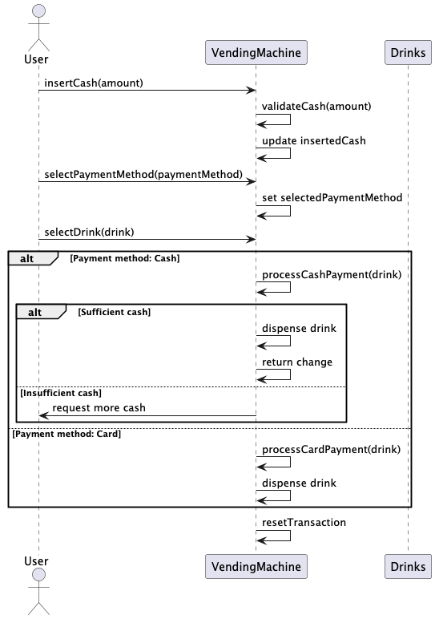
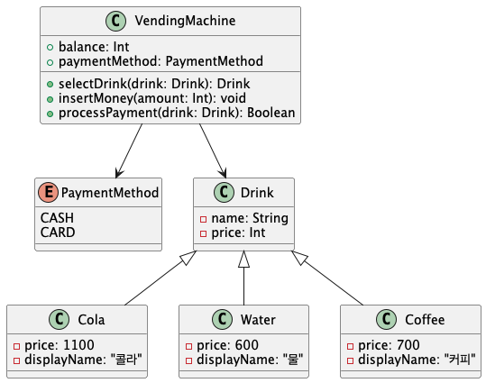

# Vending Machine — Kotlin Modeling Exercise

Kotlin으로 자판기 도메인의 결제·재고·구매 흐름을 모델링한 연습 프로젝트입니다.

> 이 저장소는 상용 서비스 포트폴리오가 아니라 객체 모델링과 예외 흐름을 연습하기 위한 작은 예제입니다.

## 주요 기능

### 결제 수단

- 현금: 100원, 500원, 1,000원, 5,000원, 10,000원
- 카드

### 음료

- 콜라: 1,100원
- 물: 600원
- 커피: 700원

## 기본 흐름

1. 사용자가 결제 수단을 선택합니다.
2. 금액을 투입하거나 카드 결제를 요청합니다.
3. 음료를 선택합니다.
4. 자판기가 재고와 결제 가능 여부를 확인합니다.
5. 조건이 충족되면 거래를 완료합니다.

## UML

### Sequence Diagram

### Class Diagram

## 주요 클래스

- `VendingMachine` — 거래와 음료 선택 흐름 관리
- `PaymentSystem` — 현금·카드 결제 검증
- `User` — 자판기 사용자
- `Drink` — 판매 음료 모델

## 실행

JDK 17과 Kotlin/Gradle 환경에서 실행할 수 있습니다.
